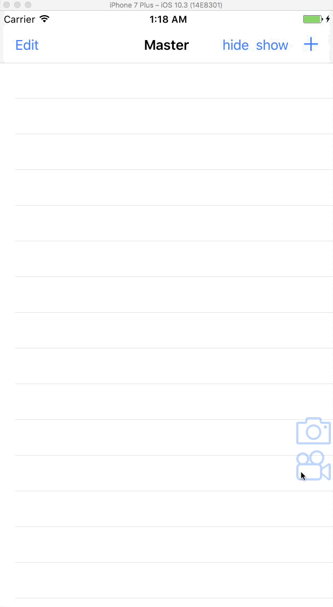

# Ajimi

[](https://github.com/Carthage/Carthage)
[](http://cocoapods.org/pods/Ajimi)
[](http://cocoapods.org/pods/Ajimi)
[](http://cocoapods.org/pods/Ajimi)
[](https://swift.org)


Ajimi means tasting. In Japanese, 味見.
Ajimi is the feedback tool, which anyone can easily feedback to project team any time.

Snapshot | Video
---- | ----
 | 

## Requirements

- Xcode 8+
- Swift 3.0+
- iOS 9+

## Installation

### CocoaPods

Ajimi is available through [CocoaPods](http://cocoapods.org). To install
it, simply add the following line to your Podfile:

```ruby
pod "Ajimi"
```

### Carthage

[Carthage](https://github.com/Carthage/Carthage) is a decentralized dependency manager for Cocoa application.

``` bash
$ brew update
$ brew install carthage
```

To integrate Kingfisher into your Xcode project using Carthage, specify it in your `Cartfile`:

``` ogdl
github "nakajijapan/Ajimi"
```

Then, run the following command to build the Kingfisher framework:

``` bash
$ carthage update
```

## Usage

### In AppDelegate

``` swift

#if DEBUG
    let ajimiOptions = AjimiOptions(
        githubBasePath: "https://hostname/api/v3",
        githubAccessToken: "tokentoken",
        githubUser: "nakajijapan",
        githubRepo: "FeedbackTool",
        imageUploadURL: URL(string: "https://hostname/image/upload")!,
        imageUploadKey: "keykey"
    )
    Ajimi.show(ajimiOptions)
#endif

```

## Author

nakajijapan, pp.kupepo.gattyanmo@gmail.com

## License

Ajimi is available under the MIT license. See the LICENSE file for more info.
